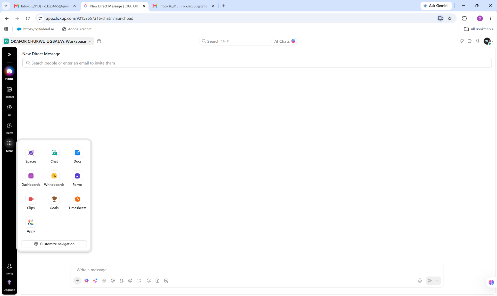
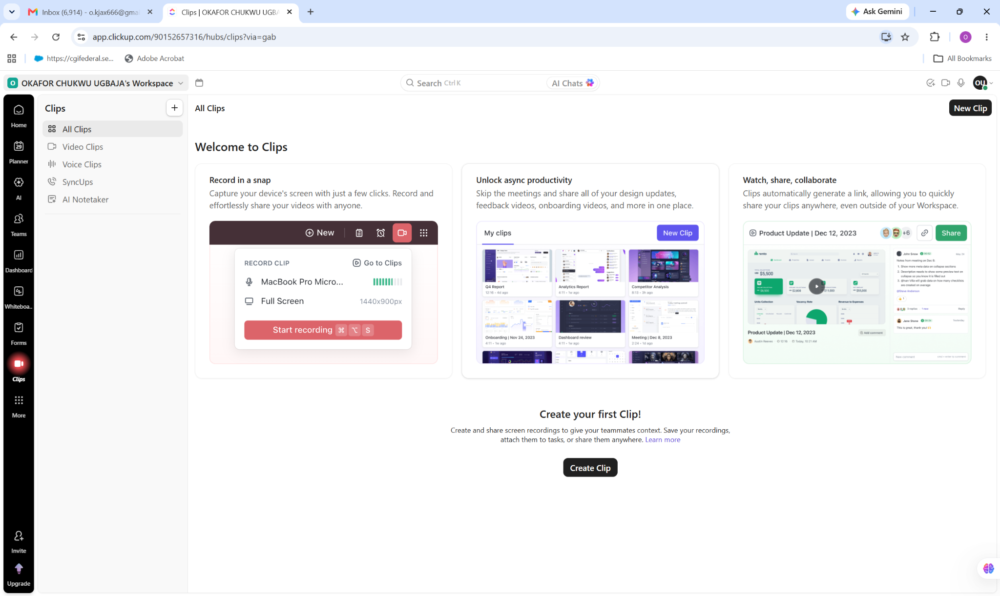

# ClickUp Project

## Project Overview

This project demonstrates practical experience using ClickUp for task management, team collaboration, workflow organization, and productivity tracking.

The project focuses on creating and organizing tasks, managing work through structured workflows, collaborating with team members, and using ClickUp features to improve visibility and efficiency.

## Key Skills Demonstrated

- ClickUp workspace navigation
- Task and project management
- Team collaboration
- Task organization
- Workflow management
- Productivity management
- Communication and collaboration
- Project tracking
- Work documentation

## Project Activities

The ClickUp project includes practical exercises involving:

1. Navigating the ClickUp workspace
2. Using ClickUp Chat for communication
3. Creating and managing Clips
4. Organizing work and collaboration activities
5. Exploring ClickUp productivity features
6. Managing tasks and project information
7. Using ClickUp as a centralized productivity platform

## Screenshots

The screenshots below document my practical exploration of ClickUp features and demonstrate how the platform can support communication, collaboration, productivity, and workflow management.

### Screenshot 1

### Screenshot 2

## Project Outcome

This project demonstrates my ability to use ClickUp to organize work, support team collaboration, manage productivity activities, and maintain structured workflows.

## Professional Value

This practical experience demonstrates my ability to work with modern project management and productivity platforms in a professional environment, particularly for remote collaboration, customer support operations, and workflow coordination.
