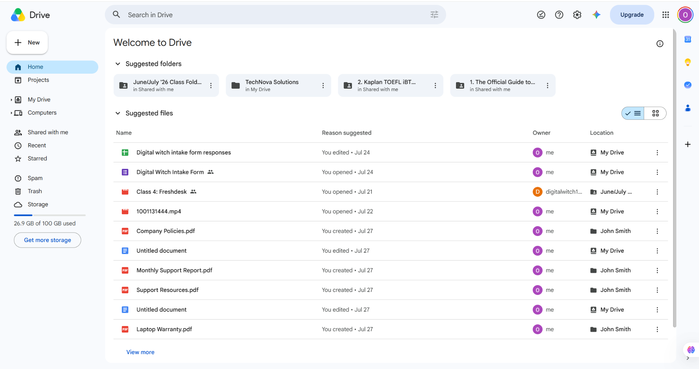
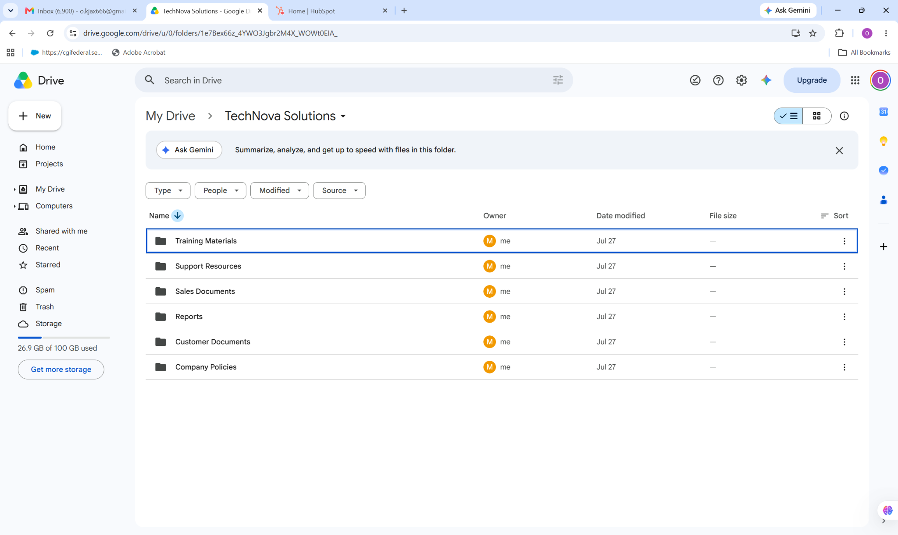
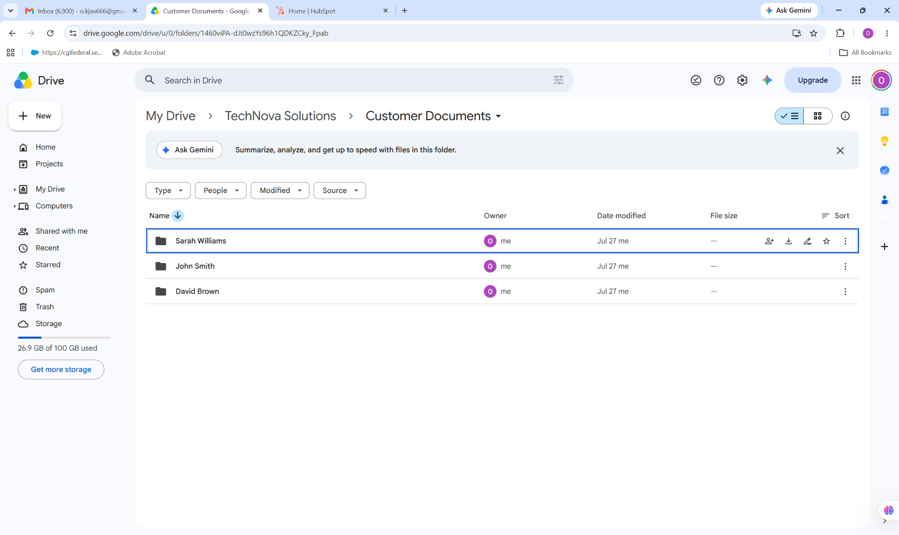
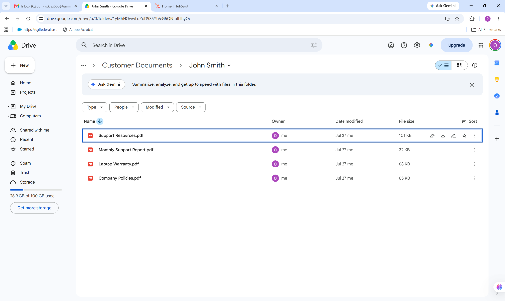

# Google Drive Project

## Project Overview

This project demonstrates practical experience using Google Drive for cloud-based file management, document organization, customer document storage, and collaborative workspace management.

The project focuses on organizing business files into structured folders, managing customer documents, and maintaining an efficient cloud-based document management system.

## Project Objectives

The objectives of this project were to:

- Navigate the Google Drive workspace
- Create and organize folders
- Manage business documents using cloud storage
- Structure customer information and documents
- Organize files for easy retrieval
- Demonstrate practical cloud file-management skills
- Support organized remote-work workflows

## Tools and Features Demonstrated

- Google Drive
- My Drive
- Folder Management
- File Organization
- Customer Document Management
- Cloud Storage
- Document Organization
- File Navigation

## Practical Activities

During this project, I practiced:

1. Navigating the Google Drive interface.
2. Accessing and organizing files within My Drive.
3. Exploring a structured business workspace.
4. Navigating the Customer Documents folder.
5. Organizing customer folders.
6. Accessing customer-specific documentation.
7. Managing documents within a customer folder.
8. Applying structured file-management practices for efficient document retrieval.

## Screenshots

The screenshots below document my practical Google Drive file-management and organization workflow.

### Screenshot 1 — Google Drive Home

This screenshot demonstrates the Google Drive home interface and access to files and folders.

### Screenshot 2 — Business Workspace

This screenshot demonstrates a structured business workspace containing organized folders for training materials, support resources, sales documents, reports, customer documents, and company policies.

### Screenshot 3 — Customer Documents

This screenshot demonstrates the organization of customer folders within a dedicated Customer Documents directory.

### Screenshot 4 — Customer Document Management

This screenshot demonstrates organized customer-specific documentation, including support resources, reports, warranty information, and company policy documentation.

## Skills Demonstrated

- Cloud file management
- Digital document organization
- Folder structure management
- Customer document management
- Information organization
- File retrieval and navigation
- Remote-work collaboration
- Attention to detail
- Digital productivity

## Project Outcome

This project demonstrates my ability to organize and manage business information using Google Drive while maintaining a clear and structured cloud-based filing system.

## Professional Value

Practical Google Drive experience demonstrates my ability to manage digital documents, organize customer information, maintain structured file systems, and support efficient remote business operations.
