# HubSpot CRM — Customer Relationship Management Portfolio

## Project Overview

This project demonstrates my hands-on experience using **HubSpot CRM** to manage customer information, track customer interactions, organize support activities, manage sales opportunities, coordinate follow-ups, and maintain structured customer relationship workflows.

The project was designed as a practical CRM simulation based on real-world customer support and sales operations. It demonstrates how CRM systems can be used to maintain accurate customer records, document interactions, manage customer requests, track deals, schedule follow-ups, and support customers throughout their journey.

Through this project, I practiced using HubSpot CRM to create and manage customer records, document customer communications, organize activities, track sales opportunities, manage follow-up tasks, and maintain visibility across customer relationships.

---

## Project Objectives

The primary objectives of this project were to demonstrate my ability to:

- Create and manage customer contact records
- Maintain accurate customer information
- Organize customer data within a CRM
- Track customer interactions and activities
- Document customer support requests
- Record customer communication history
- Manage follow-up tasks and reminders
- Track sales opportunities and deals
- Monitor deal stages within a sales pipeline
- Associate customer records with sales activities
- Support customer issue resolution
- Maintain organized customer relationship workflows
- Improve visibility into customer and sales activities
- Use CRM data to support timely customer follow-up

---

## Tools Used

### HubSpot CRM

The primary platform used for this project was **HubSpot CRM**.

Key areas practiced include:

- Contacts
- Contact Records
- Contact Properties
- Customer Activities
- Notes
- Email Communication
- Tasks
- Follow-Up Management
- Deals
- Sales Pipeline
- Deal Stages
- Customer Support Documentation
- Customer Interaction Tracking

---

# CRM Workflow Demonstrated

The project demonstrates a structured customer relationship workflow:

**Customer Request → Contact Record → Customer Interaction → Documentation → Task/Follow-Up → Deal or Support Resolution → Customer Relationship Management**

This workflow demonstrates how customer information and activities can be organized within a CRM to provide better visibility, consistency, and follow-up.

---

# 1. Contact Management

Customer contact management is one of the core components of this project.

I created and managed customer records containing information such as:

- Customer name
- Email address
- Phone number
- Contact owner
- Job title
- Lifecycle stage
- Lead status
- Last contacted date
- Customer activities
- Associated deals
- Support-related information

Maintaining structured contact records helps customer support and sales teams quickly understand who the customer is, what interactions have taken place, and what action may be required next.

### Screenshot — HubSpot Contacts Overview

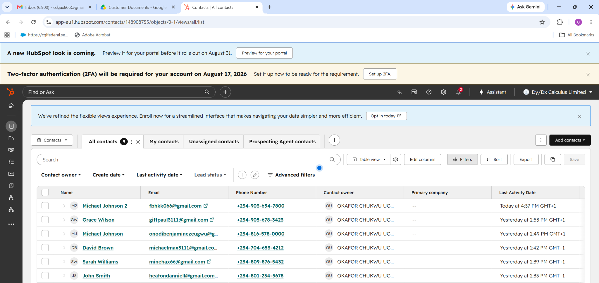

---

# 2. Customer Contact Record Management

I practiced working with individual customer records to review customer information and understand the customer's relationship history.

The contact record provides a centralized view of important information and customer activities.

This included reviewing:

- Customer profile information
- Contact ownership
- Customer status
- Previous interactions
- Notes
- Emails
- Tasks
- Deals
- Follow-up activities

### Screenshot — Customer Contact Record

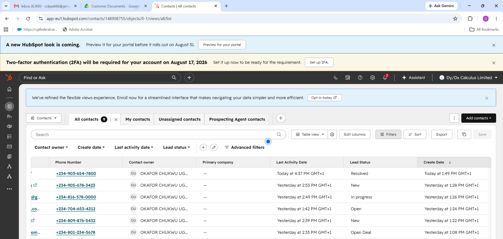

---

# 3. Customer Activity Tracking

A key part of CRM management is maintaining a clear history of customer interactions.

I used HubSpot activities to document and track customer-related actions such as:

- Notes
- Emails
- Calls
- Tasks
- Follow-ups
- Customer status changes
- Sales activities

This provides a chronological record of customer interactions and helps ensure that important customer information is not lost.

### Screenshot — Customer Activity Tracking

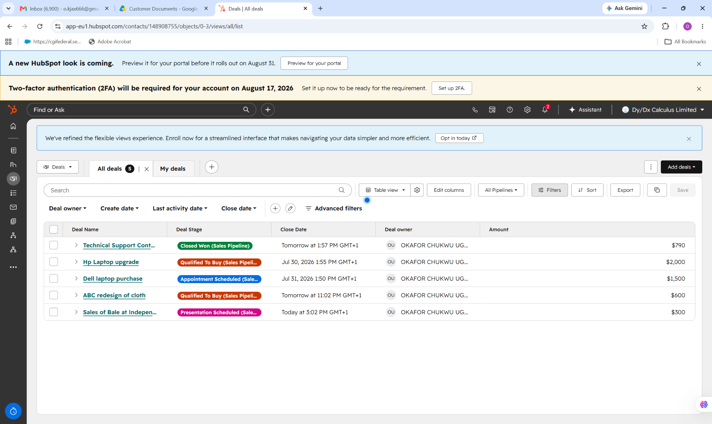

---

# 4. Contact Record Activity Management

I practiced reviewing detailed activities associated with customer records.

This included monitoring:

- Previous customer communications
- Support-related notes
- Customer requests
- Follow-up activities
- Deal activities
- Changes to customer status
- Assigned tasks

Maintaining this activity history supports better customer service because support representatives can understand the customer's previous interactions before responding.

### Screenshot — Contact Record Activity

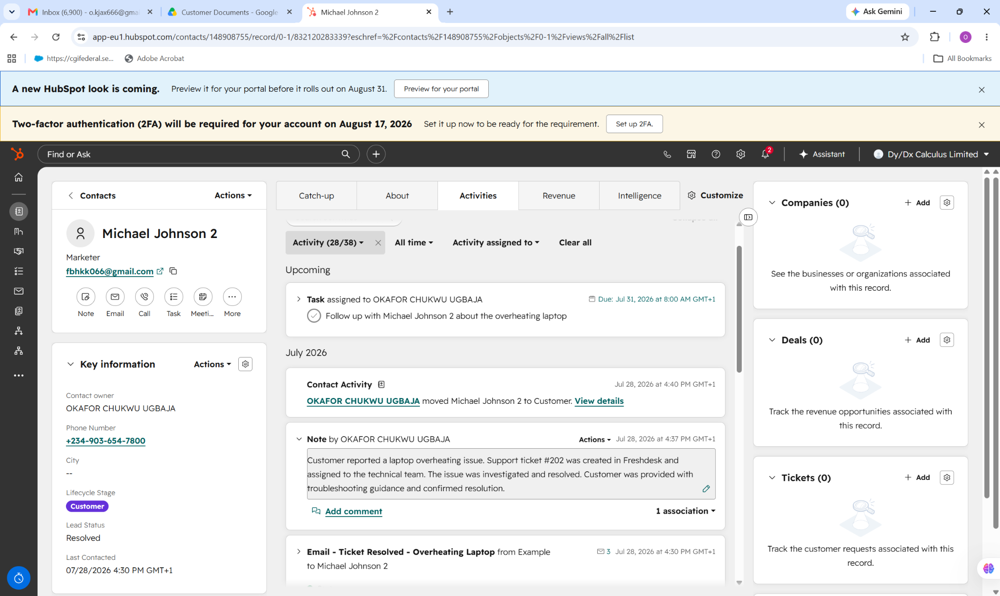

---

# 5. Customer Support Email & Ticket Documentation

I practiced documenting customer support communication and linking customer requests with support-related activities.

The workflow demonstrates how customer communications can be recorded and reviewed as part of the customer's CRM history.

This helps support teams:

- Understand the customer's issue
- Review previous communication
- Track the progress of a request
- Maintain communication history
- Provide consistent follow-up
- Confirm issue resolution

### Screenshot — Customer Support Email & Ticket

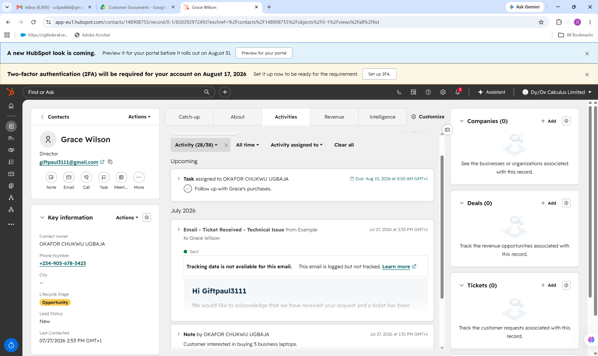

---

# 6. Customer Follow-Up Management

Effective follow-up is an important part of both customer service and sales.

I created and managed follow-up activities to ensure that customer requests, opportunities, and outstanding actions were not overlooked.

Examples of follow-up activities included:

- Calling customers
- Following up on product inquiries
- Following up on proposals
- Following up on purchases
- Monitoring unresolved requests
- Scheduling future customer contact

### Screenshot — Customer Follow-Up

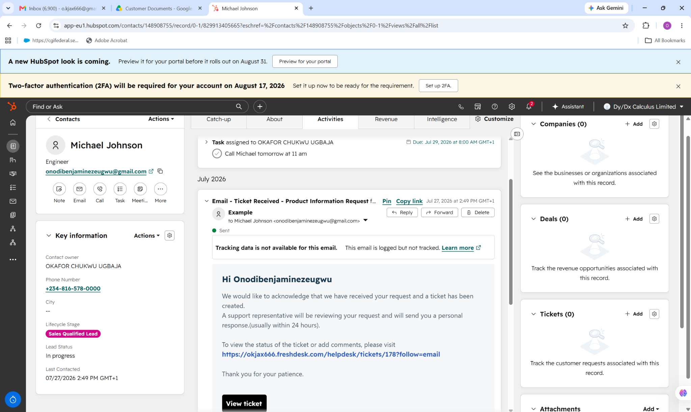

---

# 7. Deal & Sales Pipeline Management

I also practiced using HubSpot's **Deals** functionality to track sales opportunities through different stages of the sales process.

The project included managing opportunities such as:

- Laptop purchases
- Laptop upgrades
- Technical support contracts
- Product-related opportunities

Deal stages were used to represent the progress of each opportunity.

Examples of stages included:

- Appointment Scheduled
- Qualified to Buy
- Closed Won
- Other sales pipeline stages

### Screenshot — HubSpot Deal Pipeline

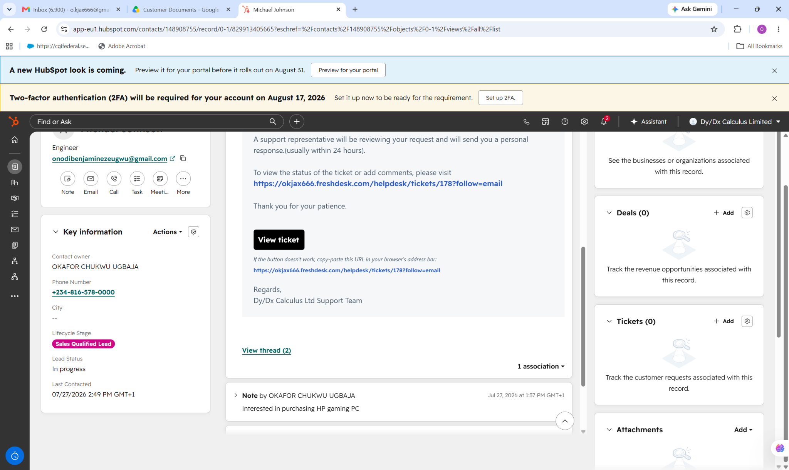

---

# 8. Customer-to-Deal Association

I practiced associating customer records with sales opportunities.

This creates a relationship between the customer and the corresponding deal, allowing relevant customer information and sales activities to be viewed together.

This is useful for understanding:

- Which customer is associated with an opportunity
- What product or service they are interested in
- The value of the opportunity
- The current deal stage
- The next follow-up action

### Screenshot — Customer & Deal Association

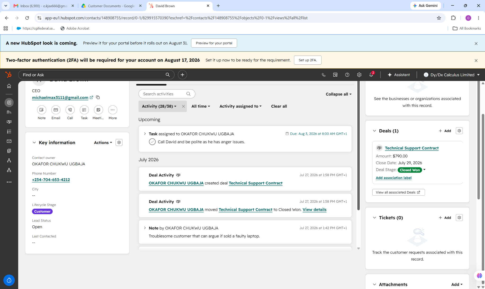

---

# 9. Customer Email & Ticket Workflow

The project also demonstrates how customer communication can form part of a structured support workflow.

Customer requests were documented through email-related activities, allowing the support process to be followed from the initial request through subsequent communication and resolution.

This demonstrates practical understanding of:

- Customer communication
- Support request documentation
- Ticket-related information
- Response tracking
- Customer follow-up
- Issue resolution

### Screenshot — Customer Email & Ticket Workflow

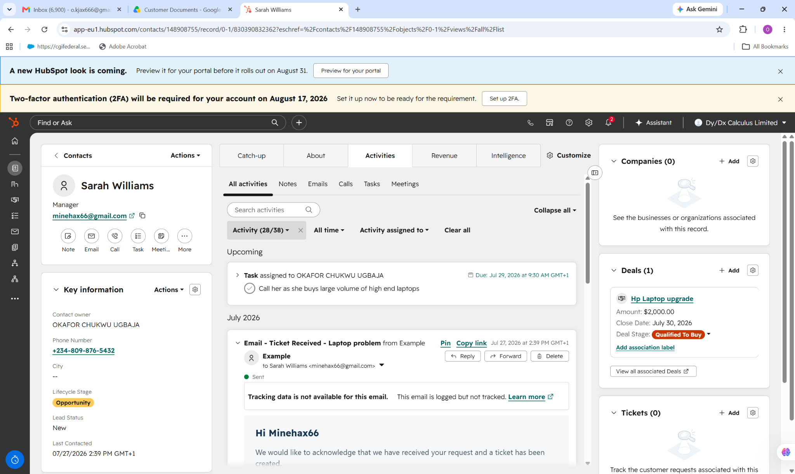

---

# 10. Customer Issue Resolution

Customer support requires more than simply responding to an inquiry. It also requires documenting the issue, investigating the request, communicating with the customer, and confirming resolution.

This project demonstrates a structured approach to documenting customer issues and recording their resolution within the CRM.

The workflow included:

1. Customer reports an issue
2. Support request is documented
3. Customer information is reviewed
4. Issue is investigated
5. Appropriate support action is taken
6. Customer is contacted
7. Resolution is documented
8. Follow-up is scheduled when necessary

### Screenshot — Ticket Resolution

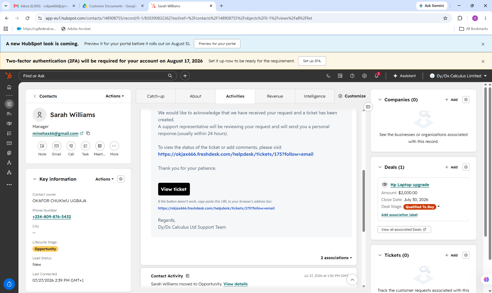

---

# 11. Customer & Deal Management

I practiced managing customer relationships alongside sales opportunities.

This demonstrates how CRM systems can connect customer information with revenue-generating activities.

The workflow helps teams understand:

- Customer profile
- Customer needs
- Current opportunity
- Deal value
- Deal stage
- Previous interactions
- Follow-up requirements

### Screenshot — Customer Deal Management

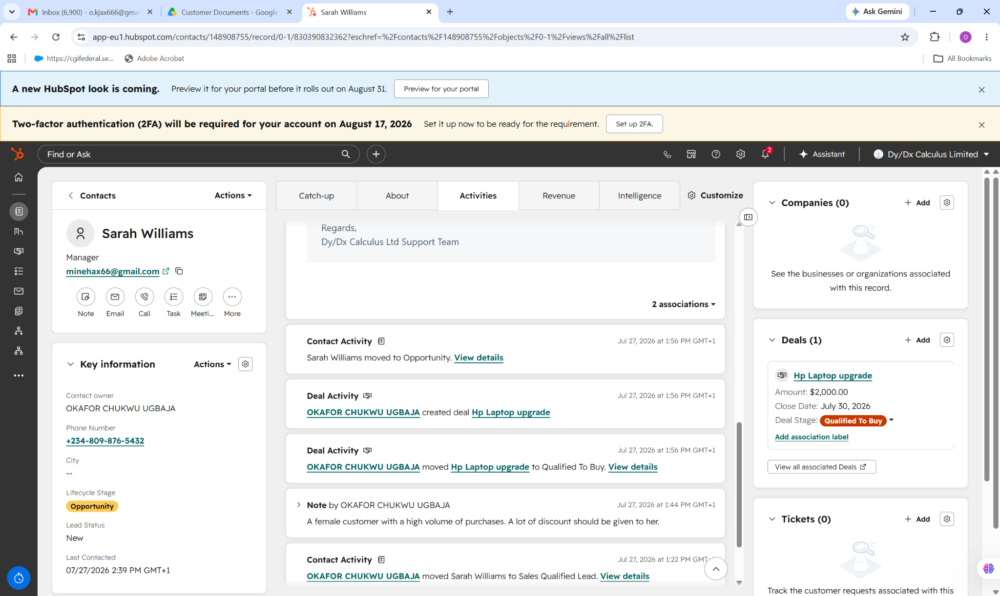

---

# 12. Sales Activity Tracking

I also practiced monitoring sales-related customer activities.

These activities provide visibility into the progress of an opportunity and help ensure that sales representatives maintain consistent communication with prospects and customers.

Activities included:

- Customer contact
- Sales communication
- Notes
- Follow-up tasks
- Deal updates
- Customer status changes

### Screenshot — Contact Sales Activity

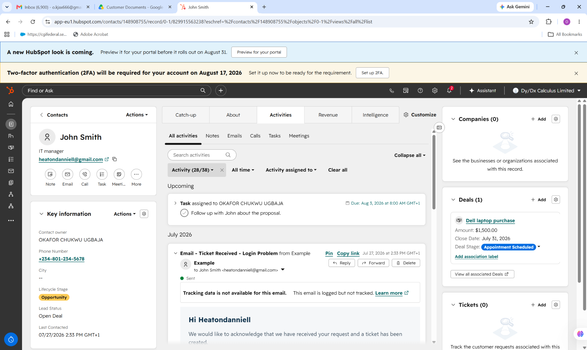

---

# 13. Deal Follow-Up

Follow-up is essential for moving opportunities through the sales pipeline.

I practiced creating and managing follow-up activities associated with customers and deals.

The workflow demonstrates how CRM tasks can be used to:

- Remember important customer actions
- Schedule calls
- Follow up on proposals
- Track customer decisions
- Maintain sales momentum
- Prevent opportunities from being overlooked

### Screenshot — Deal Follow-Up

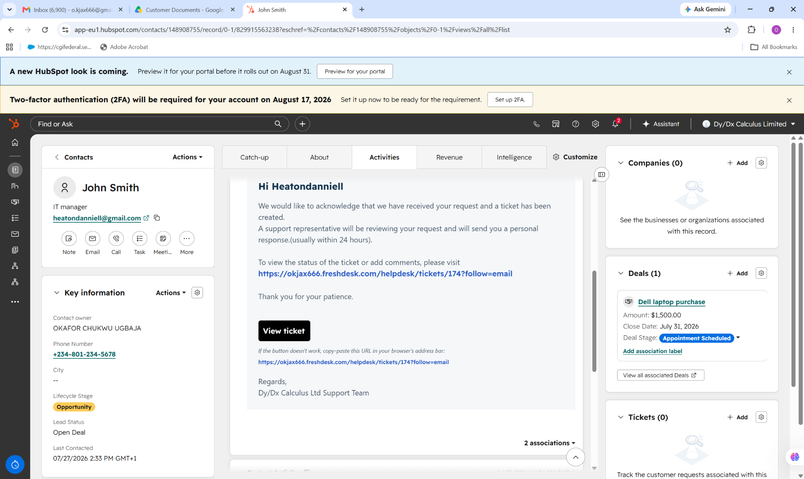

---

# 14. Customer Relationship Management

The final component of the project brings the different CRM activities together into a structured customer relationship management workflow.

The project demonstrates how customer data, communication, support activities, tasks, follow-ups, and sales opportunities can be managed within one centralized CRM environment.

This approach improves:

- Customer visibility
- Data organization
- Communication tracking
- Follow-up consistency
- Sales pipeline visibility
- Customer support coordination
- Record keeping
- Overall customer experience

### Screenshot — HubSpot CRM Customer Management

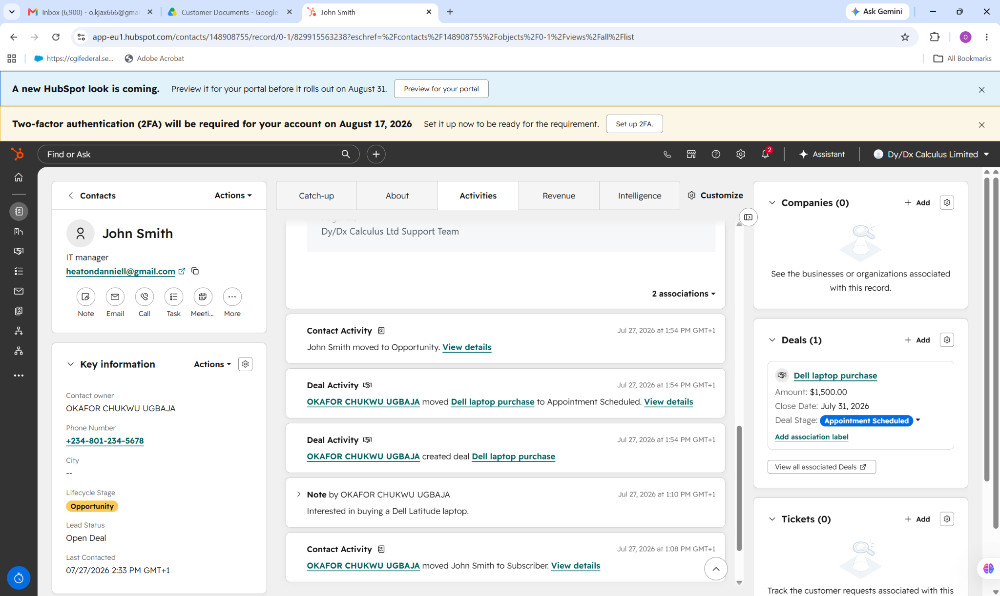

---

# Practical CRM Skills Demonstrated

Through this project, I demonstrated practical knowledge of:

### Customer Relationship Management

- Customer record management
- Customer information organization
- Customer lifecycle tracking
- Customer interaction management
- Customer relationship documentation

### Customer Support

- Support request documentation
- Customer issue tracking
- Email communication
- Customer follow-up
- Issue resolution documentation
- Support activity management

### Sales & CRM

- Deal creation
- Deal stage management
- Sales pipeline tracking
- Customer-to-deal association
- Opportunity management
- Sales follow-up

### Task & Activity Management

- Task creation
- Follow-up scheduling
- Activity tracking
- Notes management
- Customer communication history

### Data Management

- Maintaining organized customer records
- Updating customer information
- Reviewing customer history
- Maintaining accurate CRM information
- Centralizing customer-related activities

---

# Customer Support Workflow

The project follows a practical customer support workflow:

```text
Customer Request
       ↓
Create / Review Contact
       ↓
Understand Customer Issue
       ↓
Document Interaction
       ↓
Create Support Activity
       ↓
Investigate / Resolve Issue
       ↓
Communicate Resolution
       ↓
Schedule Follow-Up
       ↓
Update Customer Record
