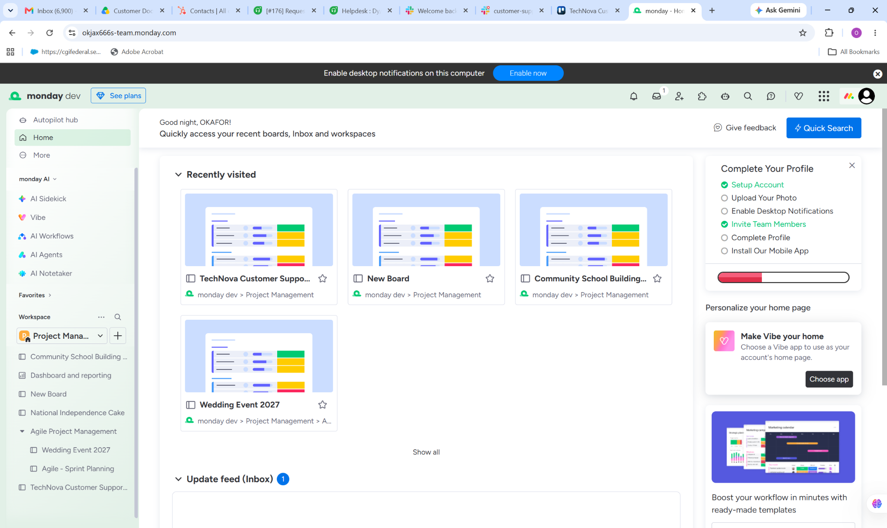
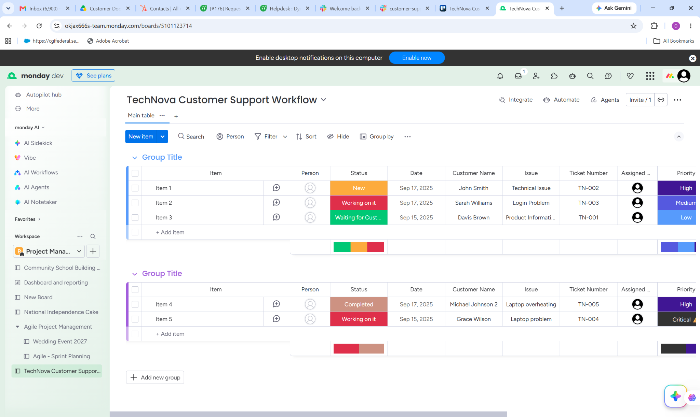
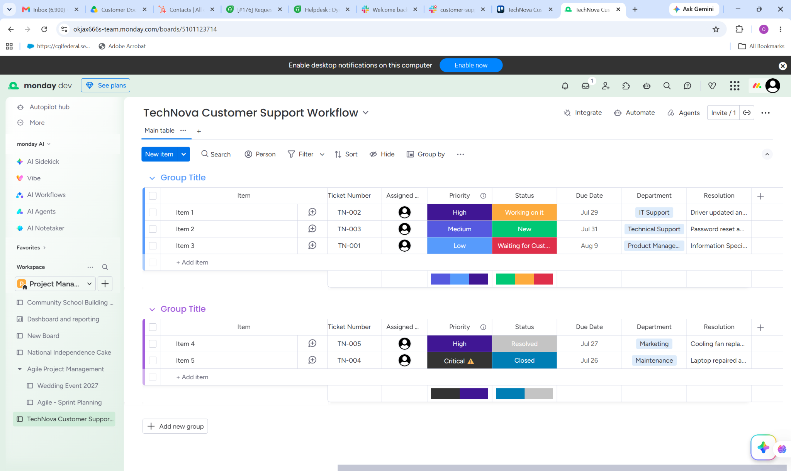

# Monday.com — Customer Support & Workflow Management Portfolio

## Project Overview

This project demonstrates my practical experience using **Monday.com** to organize customer support workflows, track service requests, manage support tickets, monitor priorities, assign responsibilities, and maintain clear visibility across ongoing and completed customer issues.

The project simulates a real-world customer support environment where multiple customer requests must be organized, prioritized, assigned, tracked, and resolved efficiently.

Using Monday.com's customizable boards, groups, status columns, priority indicators, due dates, assignments, departments, and resolution fields, I created a structured support workflow designed to improve visibility, accountability, follow-up, and issue resolution.

The project demonstrates how a customer support professional can use Monday.com to coordinate support activities while keeping customer requests and operational information organized in one centralized workspace.

---

## Project Objectives

The main objectives of this project were to demonstrate my ability to:

- Organize customer support requests in a centralized workspace
- Track customer issues from creation through resolution
- Assign support requests to responsible team members
- Prioritize customer issues based on urgency and business impact
- Monitor support ticket statuses and progress
- Set and track support deadlines
- Categorize requests by department
- Document issue resolutions
- Manage multiple customer support requests simultaneously
- Maintain visibility across active and completed support work
- Support timely follow-up and issue resolution
- Create a structured workflow that can scale with a support team

---

## Tool Used

### Monday.com

Monday.com was used as the primary workflow and customer support management platform for this project.

Key capabilities demonstrated include:

- Customizable boards
- Customer support ticket tracking
- Status management
- Priority management
- Task assignment
- Due-date tracking
- Department categorization
- Resolution tracking
- Group-based workflow organization
- Search and filtering
- Team collaboration
- Workflow visibility

---

## Support Workflow

The Monday.com board was structured to represent a practical customer support workflow.

### Workflow Process

**Customer Request**

↓

**Support Ticket Created**

↓

**Ticket Assigned**

↓

**Priority Determined**

↓

**Issue Investigated**

↓

**Support Action Taken**

↓

**Resolution Documented**

↓

**Ticket Resolved / Closed**

This workflow provides a clear structure for managing customer requests and ensures that support activities can be tracked from initial contact through completion.

---

## Board Structure

The support board contains structured information designed to provide a clear overview of customer support operations.

### Key Fields

**Item**

Represents the individual support request or ticket.

**Ticket Number**

Provides a unique reference for each customer support request.

**Assigned To**

Identifies the team member responsible for handling the request.

**Priority**

Classifies requests according to urgency and importance.

Examples include:

- Critical
- High
- Medium
- Low

**Status**

Tracks the current state of the support request.

Examples include:

- New
- Working on it
- Waiting for Customer
- Resolved
- Closed

**Due Date**

Provides a deadline for completing the support request.

**Department**

Identifies the department responsible for addressing the issue.

Examples include:

- IT Support
- Technical Support
- Product Management
- Marketing
- Maintenance

**Resolution**

Documents the action taken or solution provided to resolve the customer issue.

---

## Customer Support Scenarios

The project includes several simulated customer support scenarios designed to demonstrate different types of service requests.

### 1. Technical Issue

A customer reports a technical problem requiring investigation by the support team.

The request is recorded, assigned to the appropriate person, given a priority level, and tracked through the support workflow until resolution.

### 2. Login Problem

A customer experiences difficulty accessing an account.

The request is categorized as a support issue and tracked through investigation, resolution, and closure.

### 3. Product Information Request

A customer contacts support to request information about a product.

The request is documented and assigned to the appropriate department for response.

### 4. Laptop Overheating

A customer reports a laptop overheating problem.

The support request is treated according to its priority, assigned to the responsible team member, and tracked until an appropriate resolution is documented.

### 5. Laptop Problem

A customer reports a laptop-related problem requiring technical assistance.

The issue is tracked using a ticket number, priority, status, due date, department, and resolution field.

---

## Customer Support Management

This project demonstrates my approach to maintaining organized customer support operations.

Instead of relying on scattered notes or unstructured communication, customer requests are captured within a centralized workflow.

This makes it easier to:

- Identify outstanding requests
- Determine which issues require immediate attention
- Track who is responsible for each request
- Monitor approaching deadlines
- Identify unresolved customer issues
- Document completed resolutions
- Review historical support activity
- Maintain accountability across the support process

---

## Priority Management

An effective customer support workflow requires issues to be prioritized appropriately.

The project uses different priority levels to help distinguish urgent requests from routine requests.

### Critical

Issues requiring immediate attention because they may significantly affect the customer or business operation.

### High

Important issues requiring prompt investigation and resolution.

### Medium

Standard customer requests that require attention within an appropriate timeframe.

### Low

Routine requests that can be handled without immediate escalation.

This approach helps support teams focus resources on the issues that require the greatest attention.

---

## Status Management

The board uses status indicators to provide visibility into the progress of each support request.

### New

The request has been received but work has not yet started.

### Working on It

A support representative is actively investigating or handling the issue.

### Waiting for Customer

The support team requires additional information or action from the customer before proceeding.

### Resolved

The reported issue has been addressed and a resolution has been documented.

### Closed

The support request has been completed and no further action is required.

---

## Task Assignment and Accountability

Assigning each support request to a responsible team member helps prevent requests from being overlooked.

The workflow allows support teams to identify:

- Who owns each request
- Which requests are currently being handled
- Which issues require follow-up
- Which tasks have been completed
- Which requests remain outstanding

This supports accountability and creates a more structured customer service environment.

---

## Due-Date Management

Due dates were incorporated into the workflow to help support representatives manage response and resolution timelines.

Tracking due dates allows teams to:

- Monitor approaching deadlines
- Identify overdue requests
- Organize workloads
- Improve follow-up
- Reduce delays in customer service
- Maintain consistent support operations

---

## Department Categorization

Support requests can involve different areas of an organization.

The project demonstrates the use of department categorization to help route issues appropriately.

Examples include:

- IT Support
- Technical Support
- Product Management
- Marketing
- Maintenance

Categorizing requests makes it easier to identify which team should handle a particular issue and improves workflow visibility.

---

## Resolution Documentation

Documenting resolutions is an important part of effective customer support.

The project includes a dedicated resolution field where the action taken to address an issue can be recorded.

This creates a useful support history and makes it easier for team members to understand:

- What happened
- What action was taken
- How the issue was resolved
- Whether additional follow-up may be required

Clear documentation also helps create consistency when similar customer issues occur in the future.

---

## Skills Demonstrated

Through this project, I demonstrated practical skills in:

- Customer support workflow management
- Ticket tracking
- Customer issue management
- Task assignment
- Priority management
- Status tracking
- Due-date management
- Support request categorization
- Resolution documentation
- Team coordination
- Follow-up management
- Workflow organization
- Operational visibility
- Customer service process improvement

---

## Business Value

A well-structured customer support workflow can help organizations improve both customer experience and internal operations.

Using Monday.com to manage support requests can help teams:

- Centralize customer support information
- Improve visibility into open issues
- Reduce missed follow-ups
- Improve task accountability
- Prioritize urgent customer problems
- Track support performance
- Improve collaboration between departments
- Maintain consistent documentation
- Create a clearer customer service process

The objective is not simply to record customer requests, but to create a structured system that helps support teams move each request toward resolution.

---

## Project Screenshots

### 1. Customer Support Workflow

This screenshot demonstrates the overall Monday.com customer support workflow, including customer names, issues, ticket numbers, priorities, statuses, and assigned team members.

---

### 2. Support Ticket Management

This view demonstrates a more detailed support-ticket structure containing ticket numbers, assignments, priority levels, status, due dates, departments, and documented resolutions.

---

### 3. Support Workflow Board

This screenshot demonstrates how customer support requests can be organized into workflow groups while maintaining visibility across different support stages.

---

## Practical Application

The workflow demonstrated in this project can be adapted for a variety of customer-facing environments, including:

- SaaS companies
- Technology companies
- E-commerce businesses
- IT service providers
- Online businesses
- Telecommunications
- Professional service organizations
- Customer success teams
- Technical support departments

The same workflow principles can be adapted to different organizations depending on their support processes, escalation procedures, service-level requirements, and team structure.

---

## My Approach

My approach to customer support workflow management is centered around four key principles:

### 1. Organization

Every customer request should be captured and organized in a structured system.

### 2. Visibility

Support teams should have a clear view of what is new, active, waiting, resolved, and closed.

### 3. Accountability

Each request should have a clear owner and an appropriate deadline.

### 4. Resolution

Customer issues should be followed through to resolution, with the outcome properly documented.

This approach helps create a more reliable and customer-focused support operation.

---

## Key Takeaways

This project strengthened my practical understanding of how workflow management platforms can support customer service operations.

It demonstrates my ability to use Monday.com to:

- Structure customer support workflows
- Manage customer requests
- Track support tickets
- Prioritize issues
- Assign responsibilities
- Monitor deadlines
- Coordinate support activities
- Document resolutions
- Maintain operational visibility

It also demonstrates my understanding that effective customer support requires more than responding to individual requests. It requires a reliable system for organizing, tracking, prioritizing, and resolving customer issues.

---

## Portfolio Summary

**Project:** Monday.com Customer Support & Workflow Management

**Platform:** Monday.com

**Focus:** Customer Support, Ticket Management, Workflow Organization, Task Tracking

**Key Capabilities:**  
Customer Request Management • Ticket Tracking • Task Assignment • Priority Management • Status Tracking • Due-Date Management • Department Categorization • Resolution Documentation • Follow-Up Management

---

## Conclusion

This Monday.com project demonstrates my practical ability to organize and manage customer support workflows using a modern work management platform.

By combining structured ticket tracking, task assignment, priority management, status monitoring, due dates, departmental categorization, and resolution documentation, I created a workflow that provides visibility and accountability throughout the customer support process.

The project reflects my ability to approach customer support from both a **customer experience** and **operational efficiency** perspective, with a focus on organized workflows, timely follow-up, clear communication, and effective issue resolution.

---

**Tools & Platforms**

`Monday.com` `Customer Support` `Ticket Management` `Workflow Management` `Task Management` `CRM` `Customer Service` `Technical Support`
