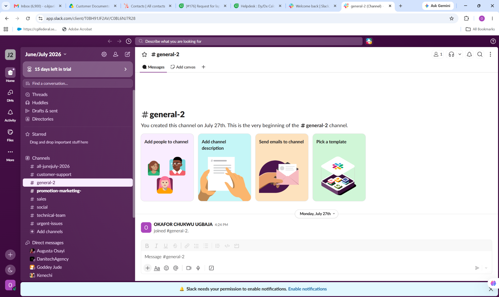
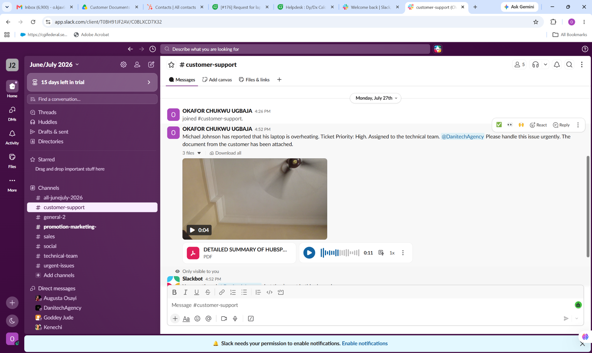
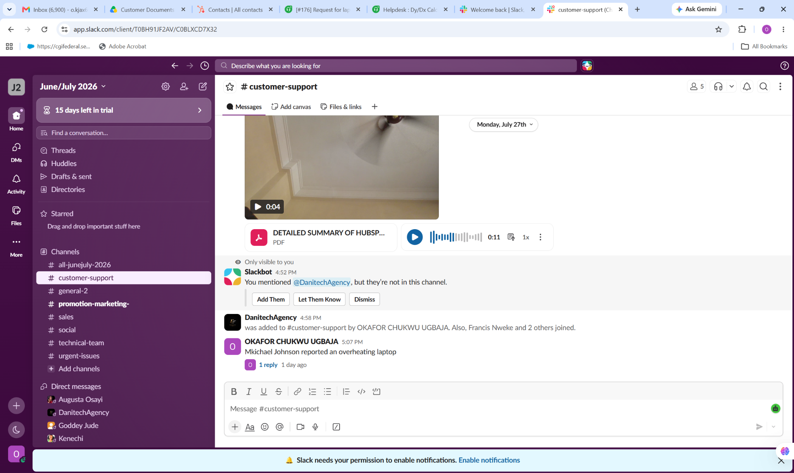

# Slack Team Communication & Customer Support Collaboration

## Overview

This portfolio project demonstrates practical experience using **Slack** for team communication, customer support coordination, issue escalation, and internal collaboration.

The project focuses on using Slack to organize support communication, share customer information, coordinate technical teams, follow up on reported issues, and maintain clear communication across different channels.

The screenshots included in this project demonstrate realistic support and collaboration workflows.

---

## Project Objectives

The main objectives of this project were to demonstrate the ability to:

- Organize communication through dedicated Slack channels
- Coordinate customer support activities
- Communicate customer issues clearly with internal teams
- Escalate technical issues to the appropriate team
- Assign and coordinate support responsibilities
- Use threads for follow-up communication
- Share customer-related documents and supporting information
- Maintain organized internal communication
- Support efficient collaboration between customer support and technical teams

---

## Slack Workflow Demonstrated

The workflow followed in this project reflects a practical customer support environment:

**Customer Issue → Support Channel → Issue Assessment → Team Assignment → Technical Escalation → Follow-up → Resolution**

This approach helps ensure that customer issues are communicated clearly and routed to the appropriate team while maintaining visibility and accountability.

---

## Key Activities Demonstrated

### 1. Workspace & Channel Organization

The Slack workspace was organized using dedicated channels for different business functions, including:

- Customer Support
- Technical Team
- Sales
- Social
- Marketing
- Urgent Issues

This structure helps teams keep conversations organized and ensures that information reaches the appropriate people.

---

### 2. Customer Support Escalation

A customer reported an overheating laptop issue through the support workflow.

The issue was communicated to the support team with:

- Customer name
- Nature of the technical problem
- Ticket priority
- Assigned technical team
- Supporting customer documentation

The issue was identified as a **high-priority technical request** and escalated to the technical team for attention.

This demonstrates the ability to communicate important customer issues clearly and efficiently.

---

### 3. Team Collaboration & Follow-Up

After the issue was communicated, the relevant team members were brought into the appropriate support channel.

A follow-up message was also created to maintain visibility of the reported issue.

Slack threads were used to keep related communication connected to the original message rather than creating unnecessary separate conversations.

---

## Customer Communication Approach

Effective customer support requires clear communication between the customer-facing team and internal technical teams.

In this project, the communication process focused on:

- Clearly identifying the customer's problem
- Communicating the urgency of the issue
- Providing relevant supporting information
- Assigning the issue to the appropriate team
- Following up on the reported problem
- Keeping internal communication organized

This helps reduce delays and improves coordination during technical support cases.

---

## Tools & Slack Features Used

### Slack

Key Slack features demonstrated include:

- Channels
- Direct Messages
- Threads
- Mentions
- File and document sharing
- Team collaboration
- Channel organization
- Internal issue escalation
- Support communication

---

## Skills Demonstrated

This project demonstrates practical skills in:

- Customer Support Communication
- Internal Team Communication
- Technical Issue Escalation
- Ticket Follow-Up
- Support Coordination
- Information Sharing
- Team Collaboration
- Issue Prioritization
- Documentation
- Remote Communication
- Slack Workspace Management

---

## Screenshot Gallery

### 01 — Workspace & Channel Overview

Demonstrates Slack workspace organization and the use of dedicated channels for customer support, technical teams, sales, marketing, and urgent issues.

---

### 02 — Customer Support Escalation

Demonstrates how a customer technical issue was communicated to the support team, prioritized, assigned to the technical team, and supported with customer documentation.

---

### 03 — Support Thread & Follow-Up

Demonstrates team collaboration, channel participation, issue follow-up, and the use of Slack threads to maintain context around a support issue.

---

## Portfolio Outcome

This project demonstrates how Slack can support a structured customer service and technical support environment by enabling teams to communicate quickly, escalate issues effectively, share relevant information, and maintain visibility throughout the support process.

The project also demonstrates the importance of organized internal communication when managing customer issues in a remote or distributed team.

---

## Note

This portfolio project was created as a practical demonstration of Slack-based customer support and team collaboration workflows. Customer names, communications, and scenarios are used for portfolio demonstration purposes.
