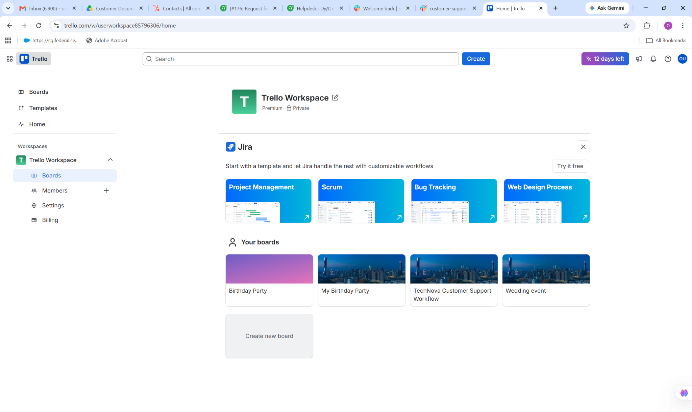
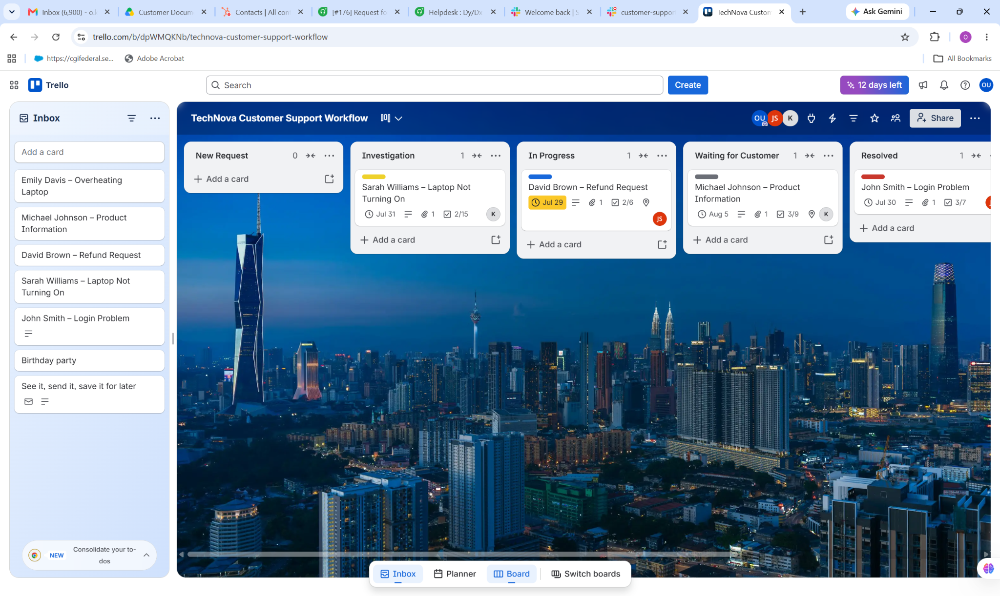
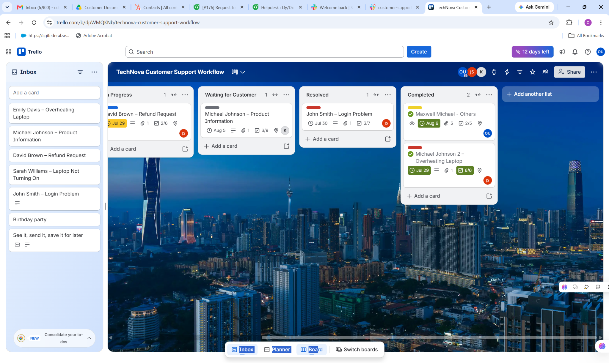

# Trello Customer Support & Workflow Management

## Project Overview

This project demonstrates my practical experience using **Trello for customer support workflow management, task tracking, ticket organization, prioritization, follow-up, and resolution tracking**.

I designed and managed a customer support workflow that provides clear visibility into incoming requests, investigations, active work, customer follow-ups, resolved issues, and completed tasks.

The project demonstrates how a structured Trello workflow can help customer support teams stay organized, improve follow-up, and maintain visibility across multiple customer issues.

---

## Objective

The objective of this project was to create a practical customer support workflow that makes it easier to:

- Organize customer support requests
- Prioritize customer issues
- Track the progress of support cases
- Assign and manage tasks
- Follow up on outstanding requests
- Monitor issues awaiting customer responses
- Track resolved and completed cases
- Maintain clear visibility across the support workflow

---

## Customer Support Workflow

The Trello board was structured into different workflow stages:

**New Request → Investigation → In Progress → Waiting for Customer → Resolved → Completed**

### 1. New Request

New customer issues are captured and organized for review.

Examples include:

- Overheating laptop
- Product information request
- Refund request
- Login problem
- Laptop not turning on

### 2. Investigation

Issues requiring troubleshooting or additional information are moved into the investigation stage.

This stage helps ensure that customer issues are properly reviewed before a solution is provided.

### 3. In Progress

Active support cases are moved into this stage while troubleshooting, customer communication, or resolution activities are being performed.

### 4. Waiting for Customer

Cases requiring additional information, confirmation, or action from the customer are tracked here.

This helps prevent unresolved tickets from being forgotten.

### 5. Resolved

Issues that have been addressed are moved to the resolved stage while the final outcome is confirmed.

### 6. Completed

Successfully completed support cases are moved here after the required actions and follow-up have been completed.

---

## Ticket and Task Management

The project demonstrates practical organization of customer support cases using Trello cards.

Each card can be used to track:

- Customer name
- Issue description
- Priority
- Assigned team member
- Due date
- Checklist
- Attachments
- Comments
- Progress status
- Follow-up actions

This structure provides a simple visual overview of the customer support workload.

---

## Examples of Support Cases

The workflow includes practical customer support scenarios such as:

| Customer | Support Issue | Workflow Stage |
|---|---|---|
| Emily Davis | Overheating Laptop | New Request |
| Michael Johnson | Product Information | Waiting for Customer |
| David Brown | Refund Request | In Progress |
| Sarah Williams | Laptop Not Turning On | Investigation |
| John Smith | Login Problem | Resolved |

These scenarios demonstrate how customer issues can be organized and tracked from initial request through resolution.

---

## Skills Demonstrated

Through this project, I demonstrated practical skills in:

- Customer support workflow management
- Task and ticket organization
- Issue prioritization
- Customer follow-up
- Case tracking
- Troubleshooting workflow
- Support documentation
- Task assignment
- Status tracking
- Resolution management
- Time and deadline management
- Team collaboration
- Remote support coordination

---

## Trello Features Used

The project demonstrates the use of several Trello features, including:

- Boards
- Lists
- Cards
- Checklists
- Due dates
- Labels
- Assignments
- Attachments
- Comments
- Card status tracking
- Workflow organization

These features were used to create a structured and visually accessible customer support management system.

---

## Customer Support Workflow Approach

My approach to managing support requests follows a structured process:

1. **Receive the customer request**
2. **Review and understand the issue**
3. **Prioritize the request**
4. **Investigate and troubleshoot**
5. **Communicate with the customer**
6. **Document the actions taken**
7. **Provide or coordinate the resolution**
8. **Follow up when necessary**
9. **Move the case through the appropriate workflow stage**
10. **Close and document the completed case**

This approach helps ensure that customer requests are properly tracked from beginning to end.

---

## Why This Workflow Matters

A well-organized customer support workflow helps teams:

- Reduce missed follow-ups
- Improve visibility into open issues
- Prioritize urgent requests
- Maintain accountability
- Improve team coordination
- Track customer issues more effectively
- Create a consistent support process
- Improve the overall customer experience

---

## Screenshot Gallery

### Trello Workspace Overview

### Customer Support Workflow Board

### Ticket Status Tracking

---

## Tools Used

**Primary Tool:**

- Trello

**Supporting Skills:**

- Customer Support
- Ticket Management
- Task Management
- Troubleshooting
- Customer Communication
- Workflow Management
- Documentation
- Team Collaboration

---

## Portfolio Outcome

This project demonstrates my ability to use Trello to create a structured and organized customer support workflow.

It showcases my understanding of **ticket management, customer communication, task tracking, prioritization, follow-up, troubleshooting coordination, and resolution management**.

The workflow is designed to provide clear visibility into customer issues while ensuring that support requests move systematically from **new request to completion**.

---

## Professional Value

I can apply these workflow management skills in remote customer support, technical support, CRM operations, customer success, and support coordination environments where organization, communication, follow-up, and accurate issue tracking are essential.

---

**Portfolio:** IT Support & Customer Service  
**Project:** Trello Customer Support & Workflow Management
